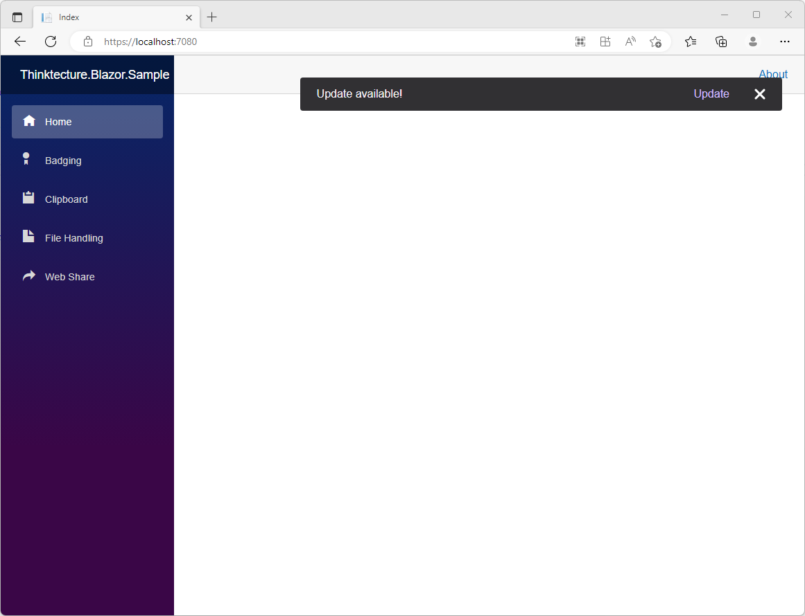

# Thinktecture.Blazor.Badging

[](https://www.nuget.org/packages/Thinktecture.Blazor.PwaUpdate/)

## Introduction

A Blazor wrapper for the [Service Worker Update](https://web.dev/service-worker-lifecycle/#update-on-reload).

The package allows subscribing to an event that fires as soon as a new update is available.

## Getting started

### Prerequisites

You need .NET 7.0 or newer to use this library.

[Download .NET 7](https://dotnet.microsoft.com/download/dotnet/7.0)

### Platform support

[Platform support for Service Worker](https://caniuse.com/serviceworkers)

### Installation

You can install the package via NuGet with the Package Manager in your IDE or alternatively using the command line:

```
dotnet add package Thinktecture.Blazor.PwaUpdate
```

## Usage

The package can be used in Blazor WebAssembly projects.

### Add to service collection

To make the UpdateService available on all pages, register it at the IServiceCollection in `Program.cs` before the host is built:

```csharp
builder.Services.AddPwaUpdateServices();
```
### Add to Imports

To use the default UpdateModal component on the hole app razor files, register it in the `_Imports.razor` file.

```html
@using Thinktecture.Blazor.PwaUpdate
```

### Update Modal

To use the default update modal, add the component to the main layout. For example:

```html
@inherits LayoutComponentBase

<UpdateModal InformationMessage="Update available!"></UpdateModal>

...

```
As soon as an update is available, a modal will appear in the upper right corner as shown in the example.



If you do not want to use the default layout, you can also pass a ChildContent, which will be displayed instead of the default. 

```html
<UpdateModal>
    <div>Update available!</div>
    <button onclick="@Reload">Update</button>
</UpdateModal>
```

Another option is to override CSS variables:
- The color of the close icon can be changed by this variable: `--close-icon-color`
    - The color must be an rgb valur like this: `255, 255, 255`
- The action button color can be changed by this variable: `--action-button-color`
    - The color must be an rgb valur like this: `208, 188, 255`
- The background color of the modal can be changed by this variable: `--modal-background`
- The text color of the modal can be changed by this variable: `--on-modal-background`

### Update Service

If you do not want to use the modal, you can also use only the update service. To do this, you can make the `IUpdateService` service available to the component, 
page, or service via dependency injection. To receive the event for an update, simply register for the `UpdateAvailable` event. 

Then call the initialization method `InitializeServiceWorkerUpdateAsync` to start the registration of the `StateChanged` event of the service worker.


```csharp
protected override async Task OnInitializedAsync()
{
    _updateService.UpdateAvailable = () => _newVersionAvailable = true;
    await _updateService.InitializeServiceWorkerUpdateAsync();
    ...
}
```


## Acknowledgements

Thanks to [Kristoffer Strube](https://twitter.com/kstrubeg) who provides [a Blazor wrapper for the File System Access API](https://github.com/KristofferStrube/Blazor.FileSystemAccess).
This library is inspired by Kristoffer's implementation and project setup.

## License and Note

BSD-3-Clause.

This is a technical showcase, not an official Thinktecture product.
